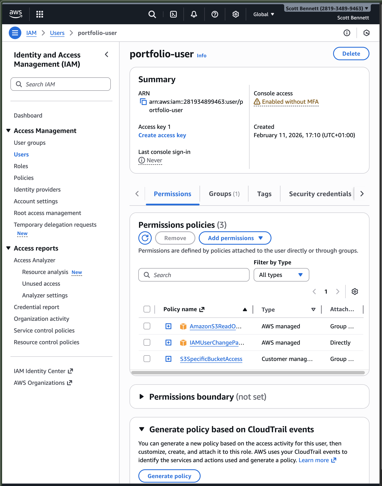
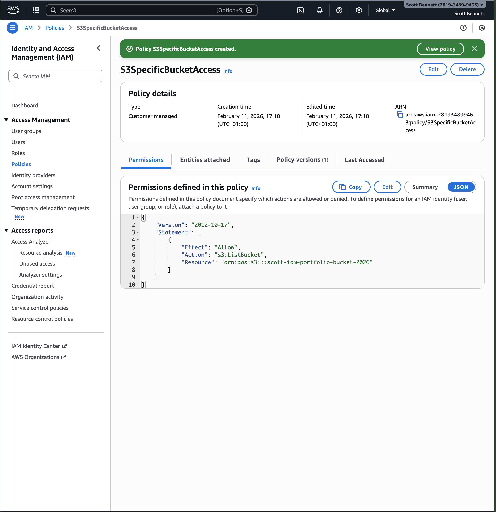
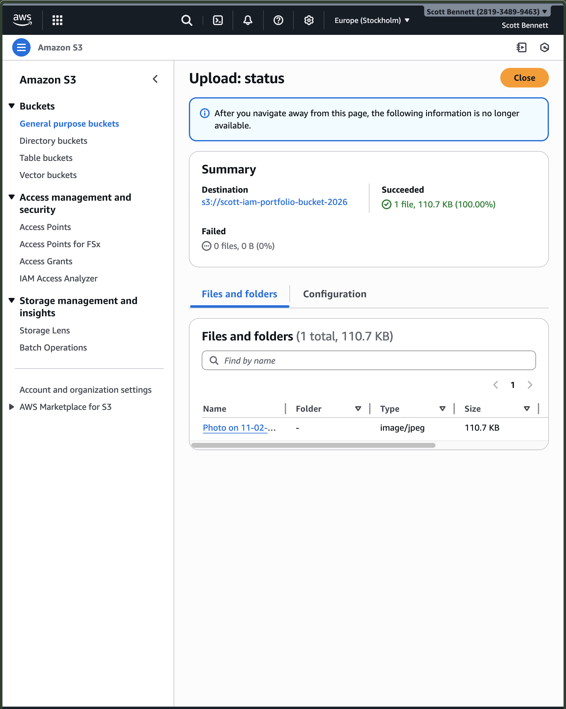

## Objective

To demonstrate practical understanding of AWS Identity and Access Management (IAM) by implementing users, groups, managed policies, and custom policies, following the principle of least privilege.

## Services Used

- AWS IAM
- Amazon S3

## Architecture Overview

User → IAM User → IAM Group → Identity-Based Policies → S3 Bucket
This project demonstrates how permissions are assigned through group membership and enforced via identity-based policies.

## Implementation Steps

1. Created an S3 bucket named scott-iam-portfolio-bucket-2026 for permission testing.
2. Created an IAM group called S3ReadOnlyGroup.
3. Attached the AWS managed policy AmazonS3ReadOnlyAccess to the group.
4. Created an IAM user named portfolio-user.
5. Added the user to the group to inherit permissions.
6. Created a custom policy (S3SpecificBucketAccess) restricting s3:ListBucket access to a single S3 bucket.
7. Attached the custom policy to the IAM group.

## Key Concepts Demonstrated

- Identity-based access control
- Principle of least privilege
- Managed vs customer-managed policies
- Resource-level permission restriction using ARN
- Permission inheritance through group membership

## What I Learned

Managed policies provide broad access and are useful for rapid configuration but may be overly permissive in production environments.
Custom policies enable granular control over specific AWS resources.
Assigning permissions to groups rather than individual users improves scalability and maintainability.
IAM policies are evaluated based on explicit allow/deny logic, reinforcing secure design principles.

## Evidence

### AM Group Permissions

### IAM User Details

### Custom Policy JSON

### S3 Bucket Overview

