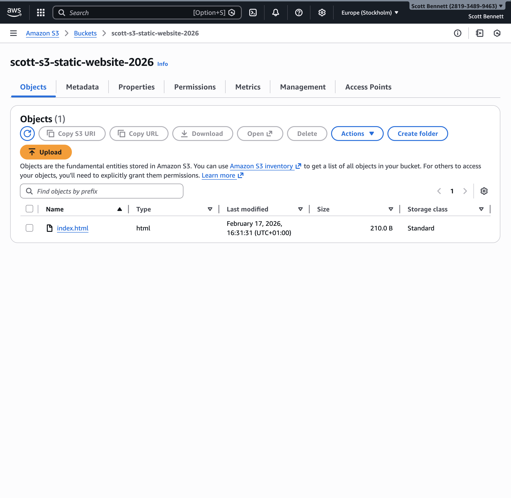
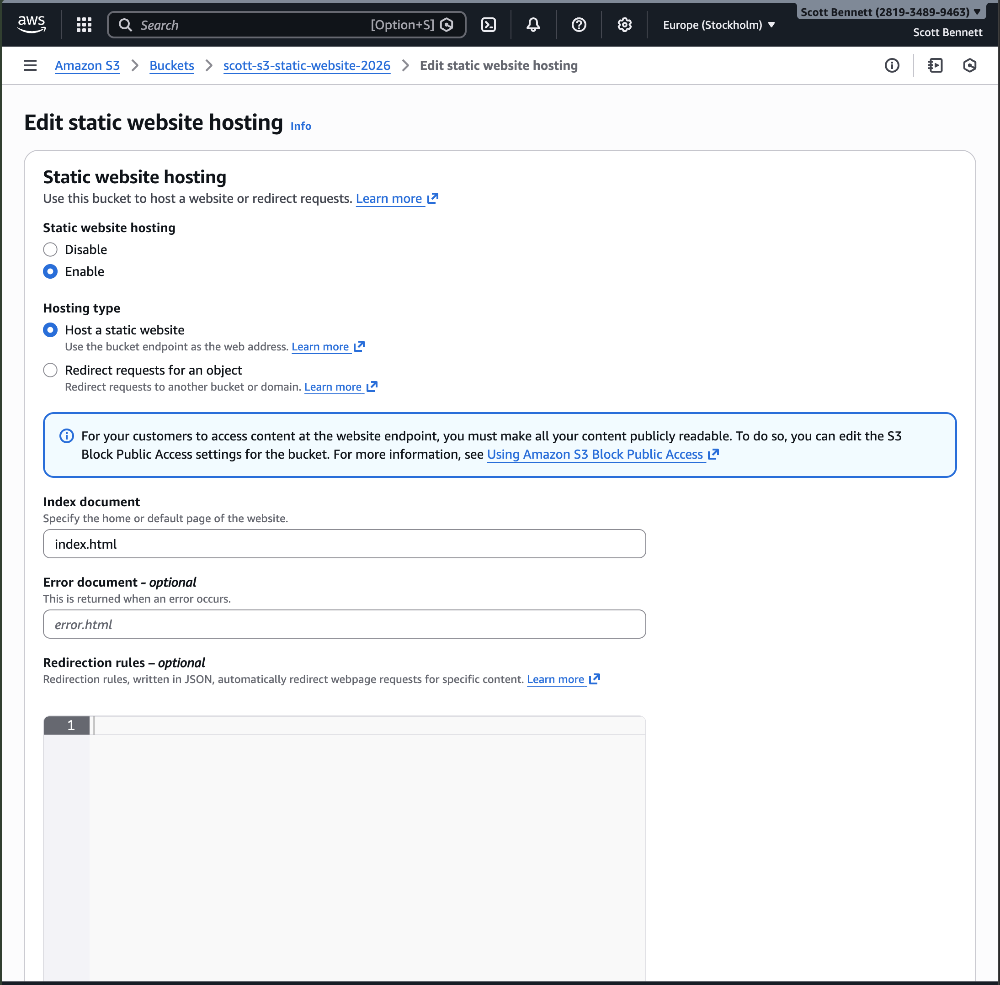
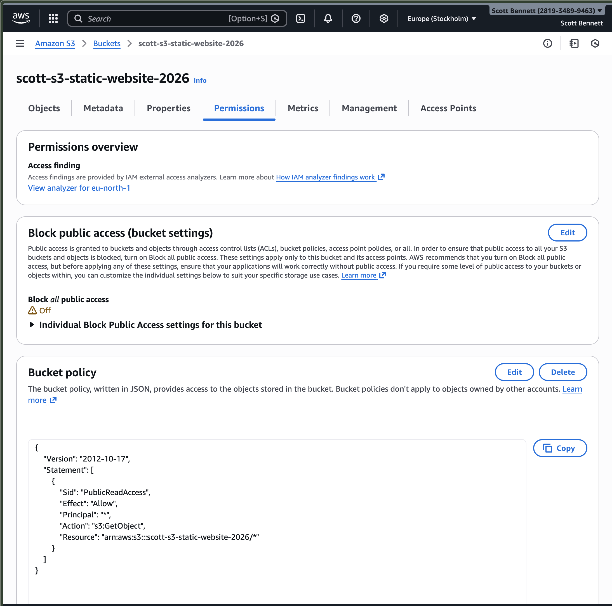
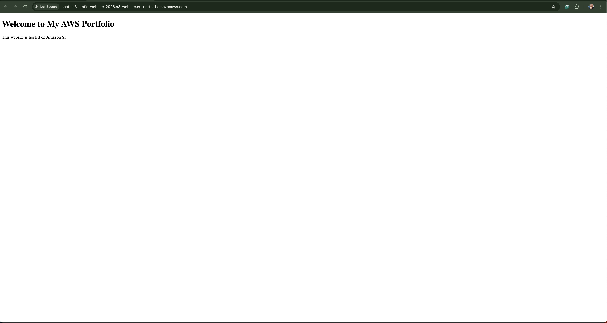
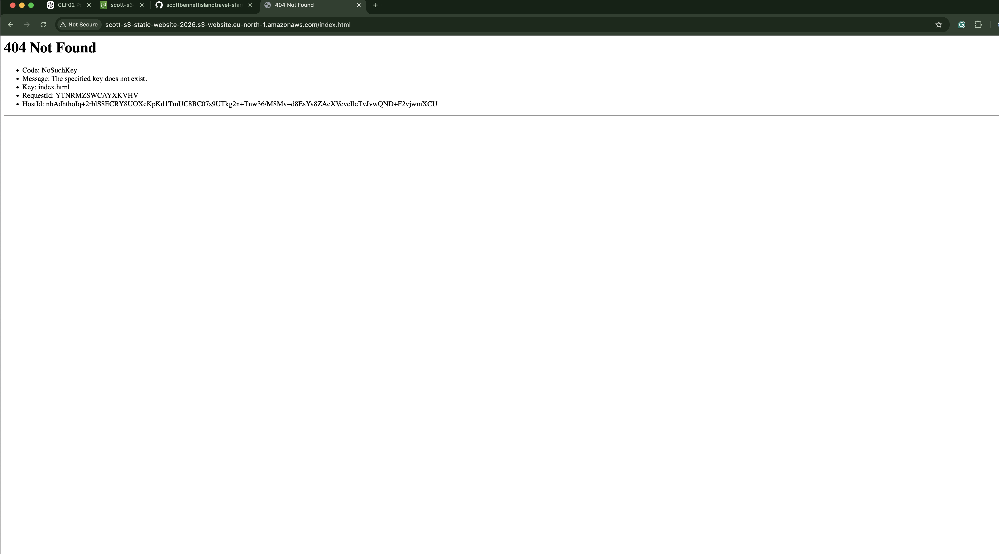

## Objective
To host a static website using Amazon S3 by configuring bucket settings, enabling static website hosting, and applying a bucket policy to allow public read access to objects.

## Services Used
- Amazon S3

## Architecture Overview
User → Internet → S3 Bucket (Static Website Hosting Enabled)
This project demonstrates how static content can be served directly from S3 without the need for a compute service such as EC2.

## Steps
1. Created an S3 bucket named scott-s3-static-website-2026
2. Disabled “Block all public access” settings to allow public hosting
3. Uploaded a static HTML file (index.html) to the root of the bucket
4. Enabled static website hosting in the bucket properties
5. Configured the index document as index.html
6. Applied a bucket policy to allow public read access (s3:GetObject)
7. Accessed the website via the S3 website endpoint

## Key Concepts Demonstrated
- Static website hosting using S3
- Public access configuration and its implications
- Resource-based policies (bucket policies)
- Object-level permissions (s3:GetObject)
- Importance of correct object key placement (index.html)
- Difference between S3 website endpoints and standard object endpoints

## What I Learned

- Amazon S3 can host static websites without requiring compute services
- Public access must be explicitly configured through both bucket settings and policies
- Bucket policies control access at the resource level, unlike IAM identity policies
- Object keys must match exactly for static hosting to function correctly
- Debugging issues in AWS is more reliable using CLI tools rather than relying solely on the console
- Misconfiguration of access or object placement can result in errors such as NoSuchKey## Debugging & Issue Resolution

## Debugging & Issue Resolution
When attempting to access the static website endpoint, the following error was returned:

- 404 Not Found
- NoSuchKey: index.html

This indicated that Amazon S3 could not locate the specified object.

### Investigation Process
Initial checks confirmed:
- The file appeared to exist in the S3 console
- Static website hosting was enabled
- The correct index document was configured

To verify the actual state of the bucket, AWS CloudShell was used.

### CLI Verification
The following command was executed:

aws s3api head-object --bucket scott-s3-static-website-2026 --key index.html

This returned a 404 error, confirming that the object did not exist at the expected key.

### Resolution
The file was re-uploaded using the AWS CLI to ensure correct placement at the root of the bucket:

aws s3 cp index.html s3://scott-s3-static-website-2026/index.html --content-type text/html

After this, the object was successfully detected and the website loaded correctly.

### Key Learning
- The AWS Management Console may not always reflect the exact state of resources
- AWS CLI provides a more reliable and precise method for verifying resource existence
- S3 object keys must match exactly; even small differences result in errors
- Debugging in AWS should be based on verification, not assumptions

This debugging process reinforced the importance of using AWS CLI tools for accurate verification and troubleshooting in cloud environments.

## Security Considerations
- Public access was intentionally enabled for static website hosting
- Bucket policy was configured to allow read-only access to objects
- Access was limited to GET requests only
- In production, additional layers such as CloudFront and HTTPS would be recommended

## Evidence
### S3 Bucket Configuration

### Static Website Hosting

### Bucket Policy

### Live Website

### 404 Error

