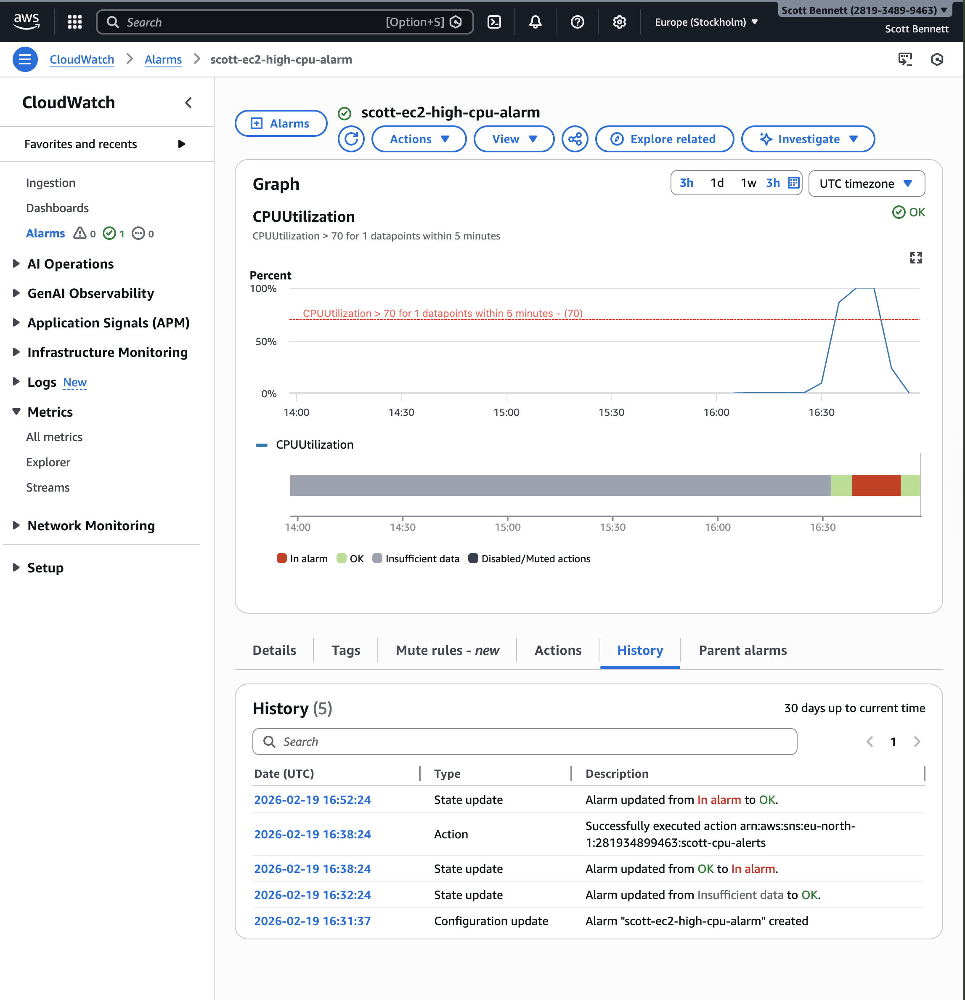
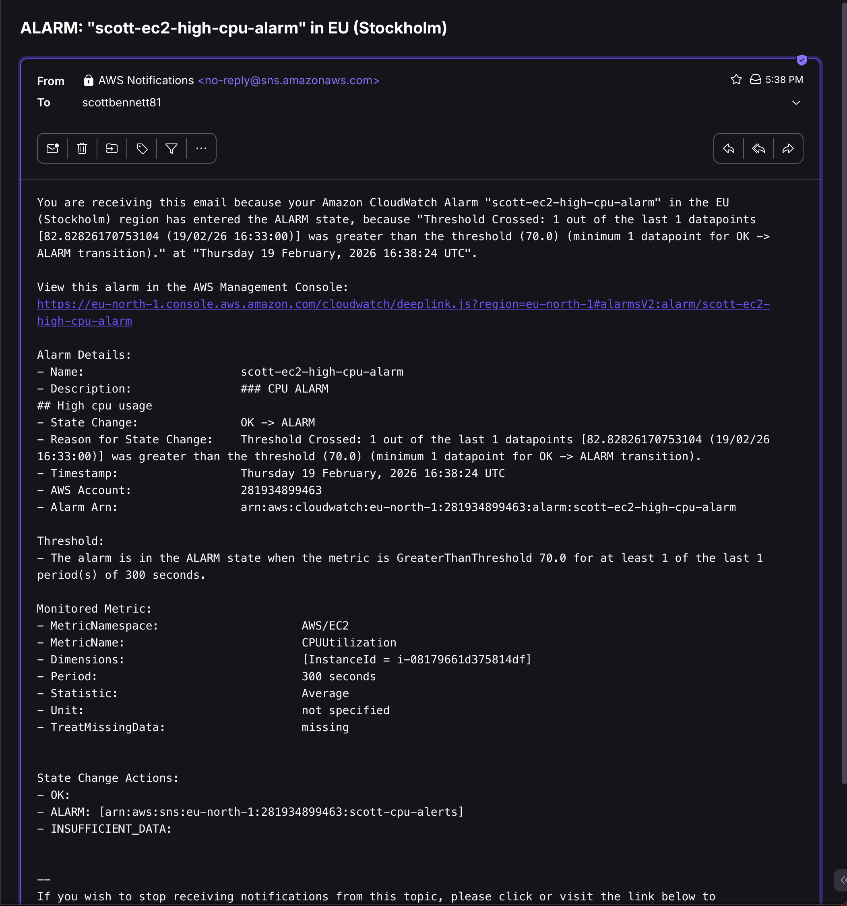
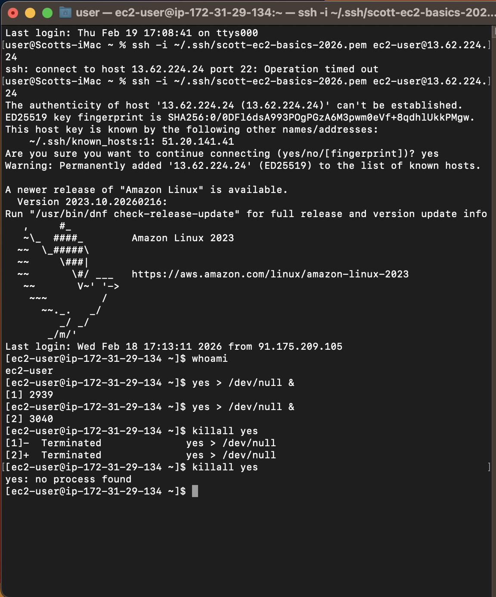

## Objective
To monitor the performance of an EC2 instance using Amazon CloudWatch by analysing metrics, creating alarms, and configuring notifications to detect high CPU utilisation.

## Services Used
- Amazon CloudWatch
- Amazon EC2
- Amazon SNS

## Architecture Overview
User → CloudWatch Metrics → CloudWatch Alarm → SNS Notification → Email Alert

This project demonstrates how system performance can be monitored in real time and how automated alerts can be configured to notify users when thresholds are exceeded.

## Steps
1. Started an existing EC2 instance (scott-ec2-basics-2026)
2. Navigated to Amazon CloudWatch in the AWS Console
3. Accessed EC2 metrics under CloudWatch → Metrics → EC2 → Per-Instance Metrics
4. Selected CPUUtilization for the EC2 instance
5. Created a CloudWatch alarm based on CPU utilisation
6. Configured alarm conditions:
   - Threshold: Greater than 70%
   - Period: 1 minute
   - Evaluation periods: 1
7. Created an SNS topic (scott-cpu-alerts) for notifications
8. Subscribed an email endpoint and confirmed the subscription
9. Triggered CPU load on the EC2 instance using:
```bash
yes > /dev/null &
```
10. Observed CPU utilisation increase in CloudWatch metrics
11. Verified alarm state transition from OK to ALARM
12. Received email notification via SNS
13. Stopped the CPU load using:
```bash
killall yes
```
14. Observed alarm returning from ALARM to OK state

## Key Concepts Demonstrated
- Monitoring cloud resources using CloudWatch metrics
- Understanding CPUUtilization as a percentage metric
- Creating and configuring CloudWatch alarms
- Using SNS for automated notifications
- Simulating system load for testing monitoring systems
- Alarm state transitions (OK → ALARM → OK)

## What I Learned
- CloudWatch provides near real-time monitoring of AWS resources
- Metrics are collected at intervals and may not update instantly
- Alarms are triggered based on evaluated conditions over time, not immediate spikes
- CPU Utilization represents the percentage of compute resources being used
- SNS can be integrated with CloudWatch to provide automated alerting
- Monitoring systems require both configuration and testing to validate functionality

## Debugging & Issue Resolution
When testing the alarm, it did not initially trigger as expected.

## Investigation Process
- Verified that CPU load was being generated on the EC2 instance
- Checked CloudWatch metrics to confirm CPU utilisation increase
- Reviewed alarm configuration settings

## Root Cause
The alarm did not trigger immediately due to CloudWatch metric collection intervals and evaluation periods.

## Resolution
Adjusted the alarm configuration to:
- Period: 5 minute
- Evaluation periods: 1
After applying these settings and re-running the load test, the alarm successfully triggered.

## Key Learning
- CloudWatch alarms are based on time-based metric evaluation, not real-time instantaneous values
- Short-lived spikes may not trigger alarms unless configuration is adjusted
- Proper configuration of period and evaluation is critical for accurate monitoring

## Security Considerations
- Monitoring does not expose system access but provides visibility into performance
- SNS notifications were configured securely using email subscription confirmation
- No sensitive data was exposed during monitoring or testing
- In production, alerts would be integrated with secure incident response systems

## Evidence

### CloudWatch CPU Metrics


### Alarm Configuration


### Alarm History (OK → ALARM → OK)


### Email Notification


### Terminal Load Simulation

