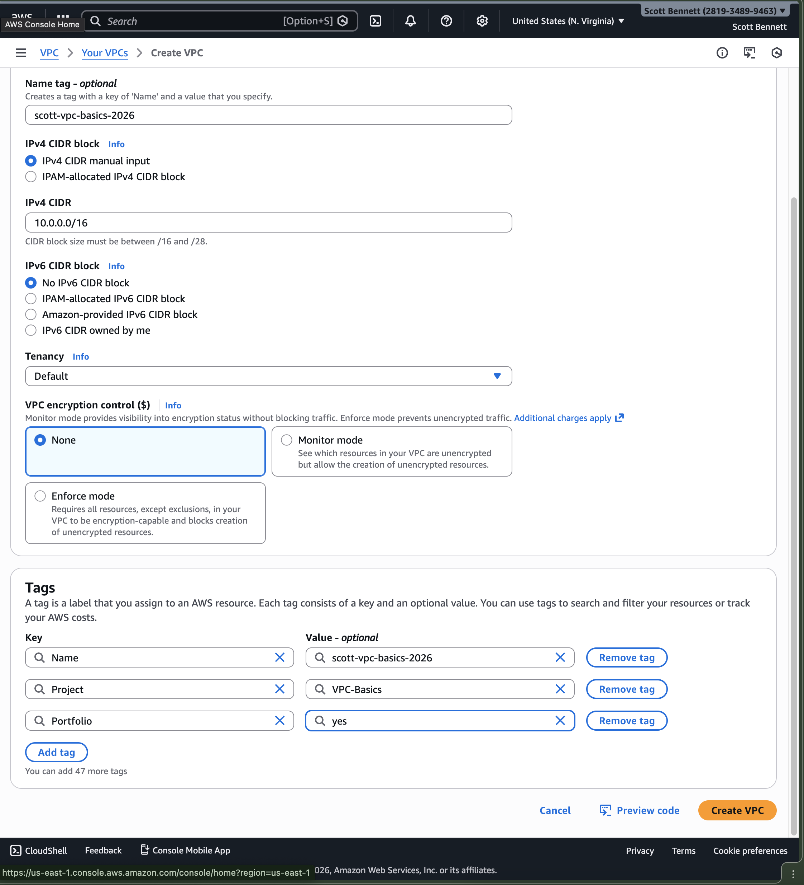
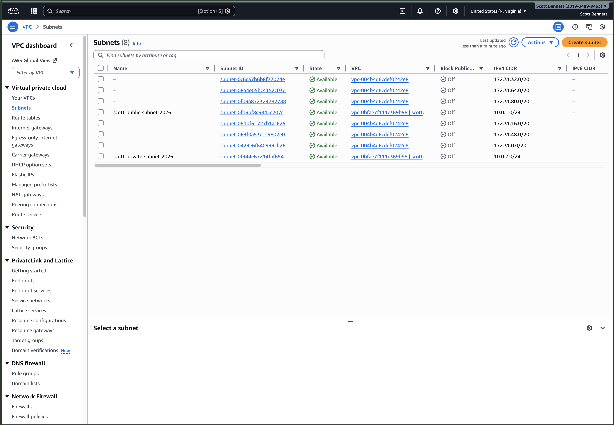
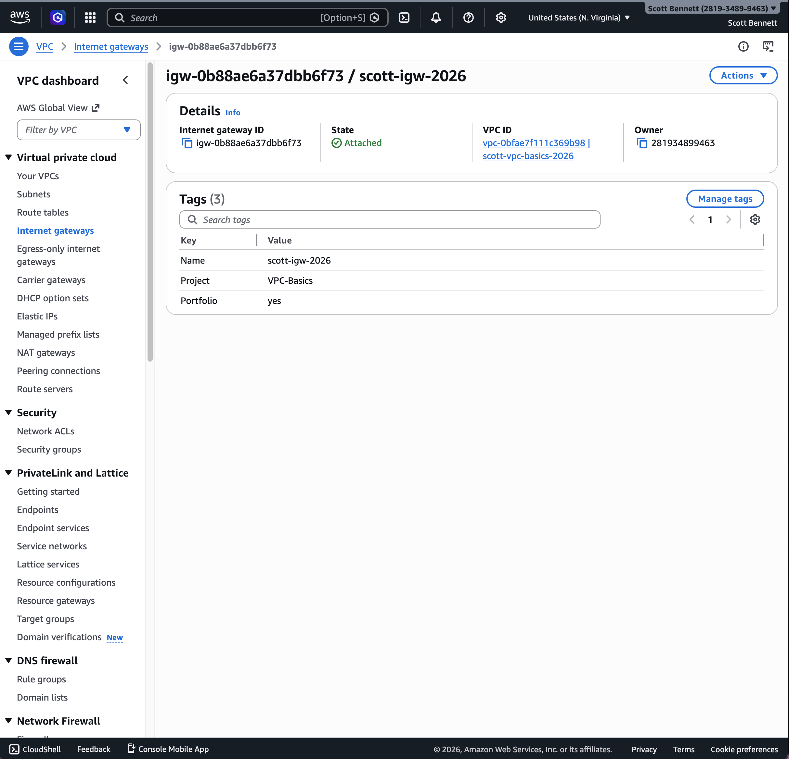
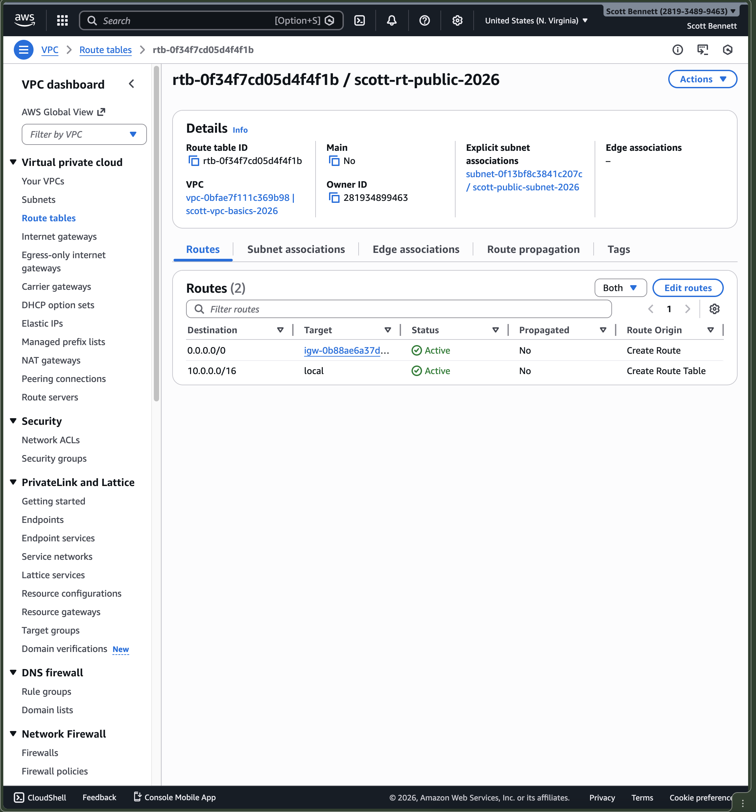
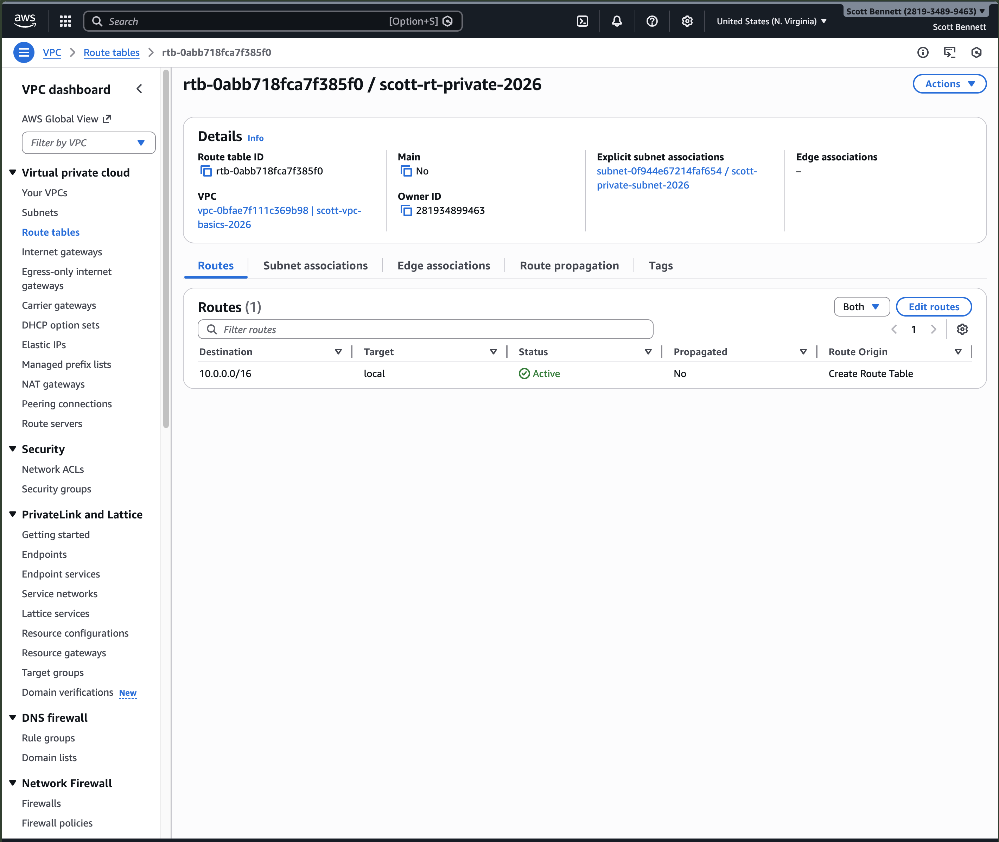
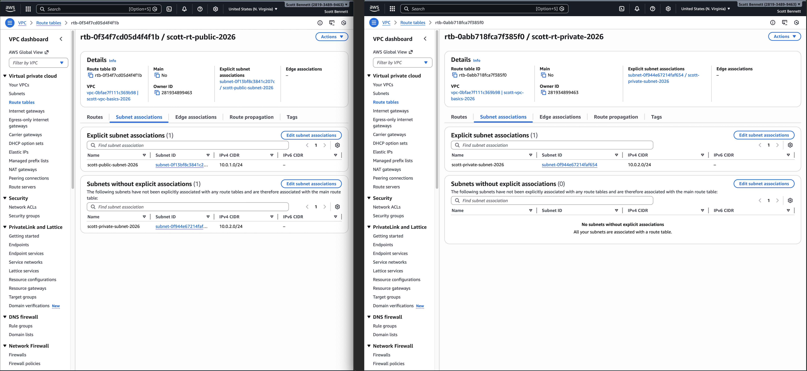
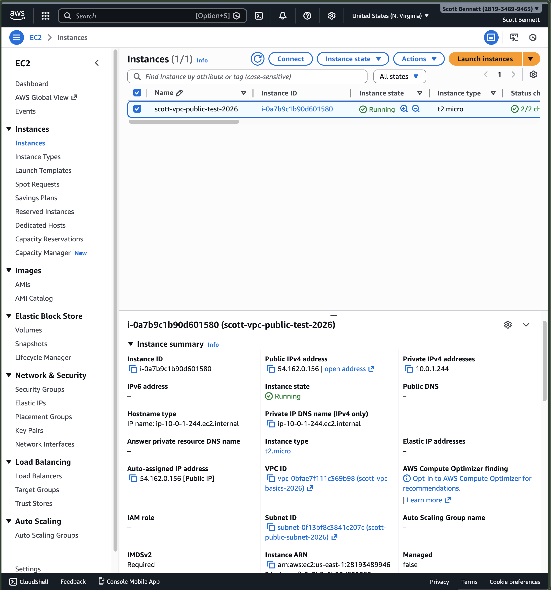
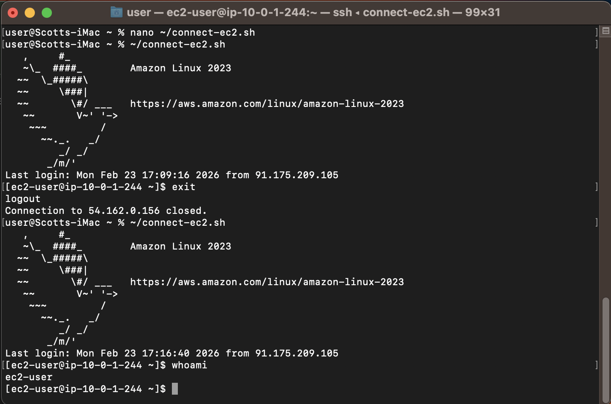
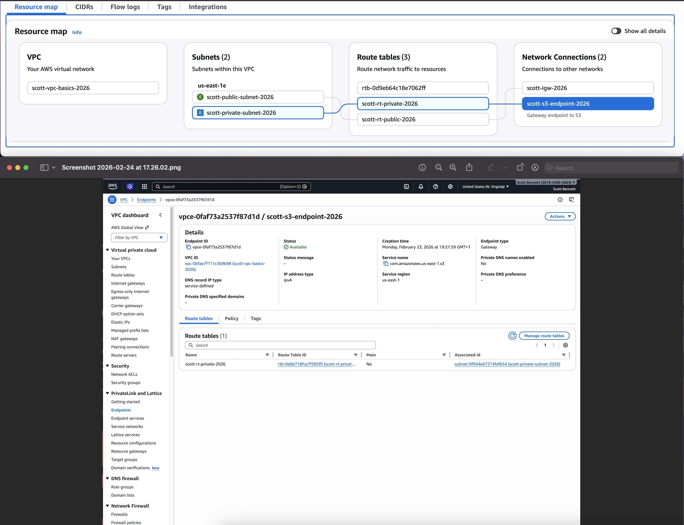

## Objective
To design and implement a custom Virtual Private Cloud (VPC) in AWS, demonstrating an understanding of network segmentation, routing, and secure access to cloud resources.

## Services Used
- Amazon VPC
- Amazon EC2
- Amazon S3

## Architecture Overview
User → Internet → Internet Gateway → Public Subnet → EC2 Instance  
Private Subnet → S3 Gateway Endpoint → Amazon S3  

This project demonstrates how to build a secure and scalable network architecture using public and private subnets, controlling traffic flow using route tables, and enabling private access to AWS services.

## Steps
1. Created a custom VPC with CIDR block 10.0.0.0/16
2. Created a public subnet (10.0.1.0/24) and private subnet (10.0.2.0/24)
3. Enabled auto-assign public IPv4 for the public subnet
4. Created and attached an Internet Gateway to the VPC
5. Created a public route table with a route (0.0.0.0/0 → IGW)
6. Associated the public route table with the public subnet
7. Created a private route table with no internet route
8. Associated the private route table with the private subnet
9. Launched an EC2 instance in the public subnet
10. Connected to the EC2 instance via SSH using a key pair
11. Created an S3 Gateway Endpoint for the VPC
12. Attached the endpoint to the private route table to enable private S3 access

## Key Concepts Demonstrated
- VPC design and CIDR block allocation
- Public vs private subnet architecture
- Internet Gateway configuration
- Route tables and traffic routing
- Secure network segmentation
- SSH access to EC2 instances
- Private connectivity using S3 Gateway Endpoints
- Principle of least exposure (minimising public access)

## What I Learned
- A VPC provides full control over network architecture in AWS
- Public subnets require an Internet Gateway and route configuration to access the internet
- Private subnets can remain isolated while still accessing AWS services securely
- Route tables are critical in directing network traffic correctly
- S3 Gateway Endpoints allow secure, private access without needing a NAT Gateway
- Cloud networking requires careful planning to balance accessibility and security

## Security Considerations
- Public access is restricted to the public subnet only
- Private subnet has no direct internet access
- SSH access is controlled via security groups and key pairs
- S3 access from private subnet is enabled without exposing resources to the public internet
- Architecture follows best practices for network isolation

## Evidence

### VPC Configuration

### Subnets

### Internet Gateway

### Public Route Table

### Private Route Table (S3 Endpoint)

### Route Table Associations

### EC2 Instance Details

### SSH Access

### S3 Gateway Endpoint

