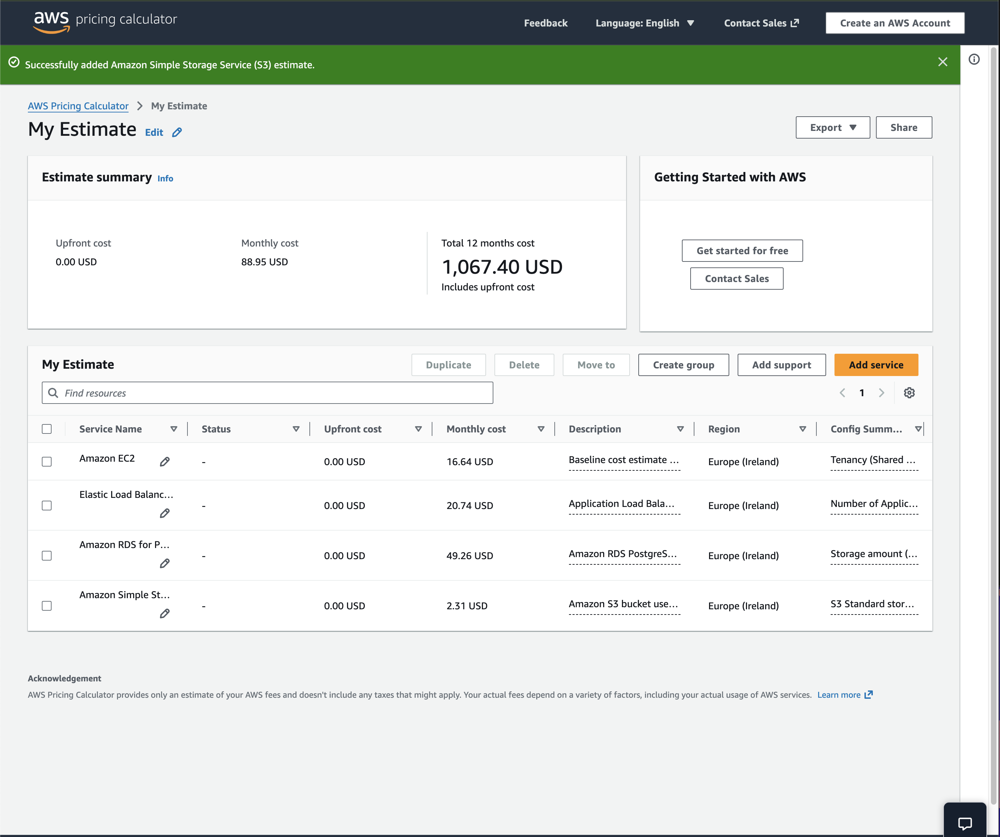
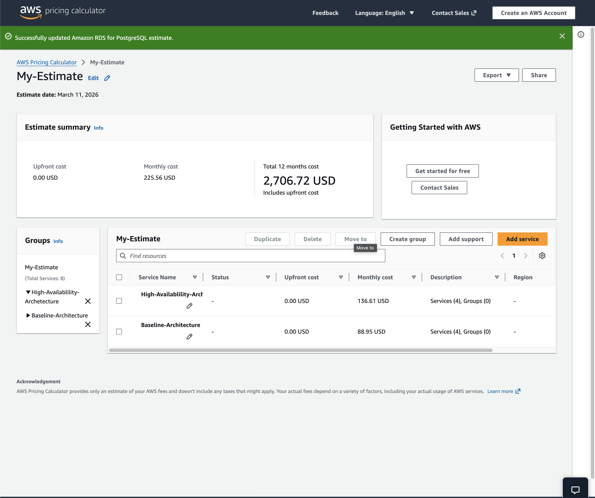
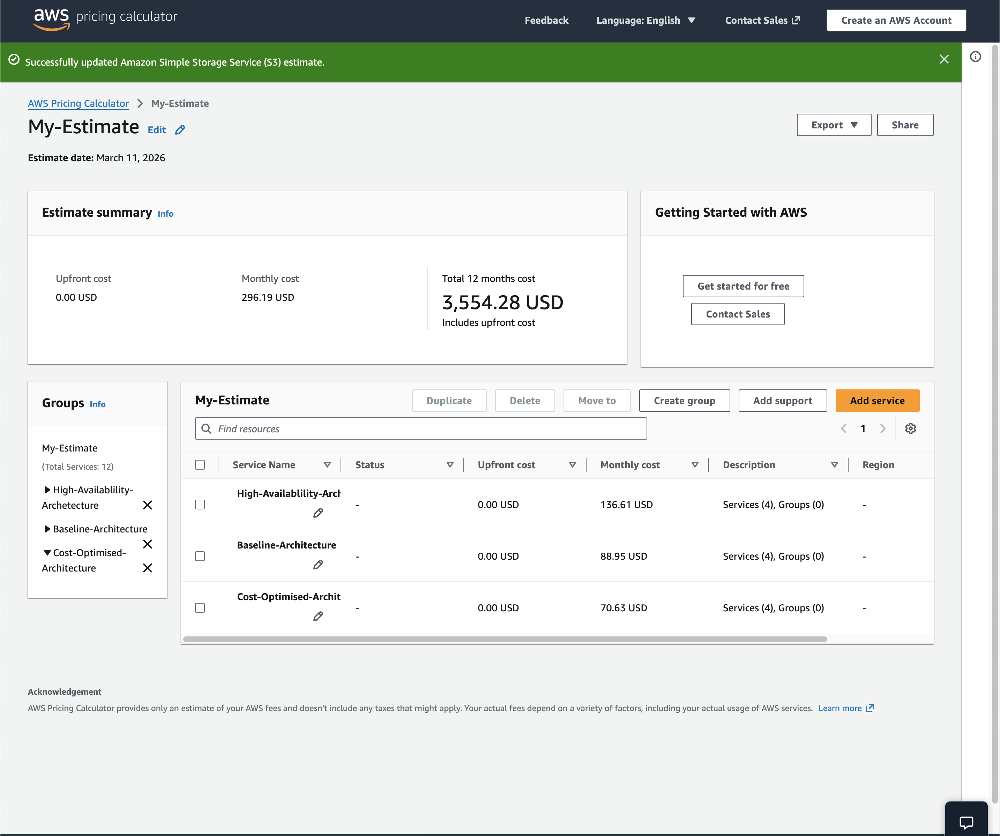
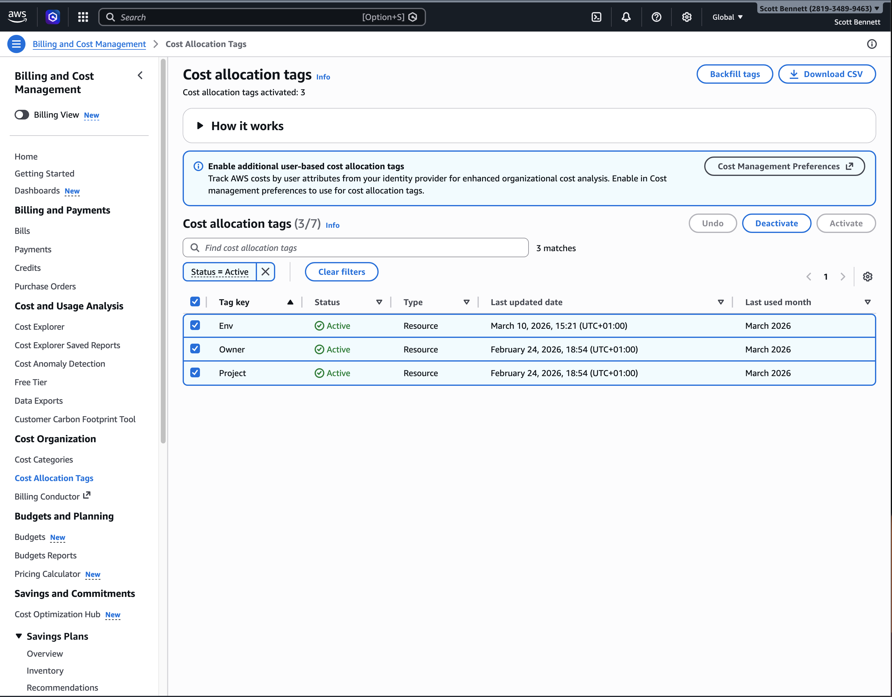
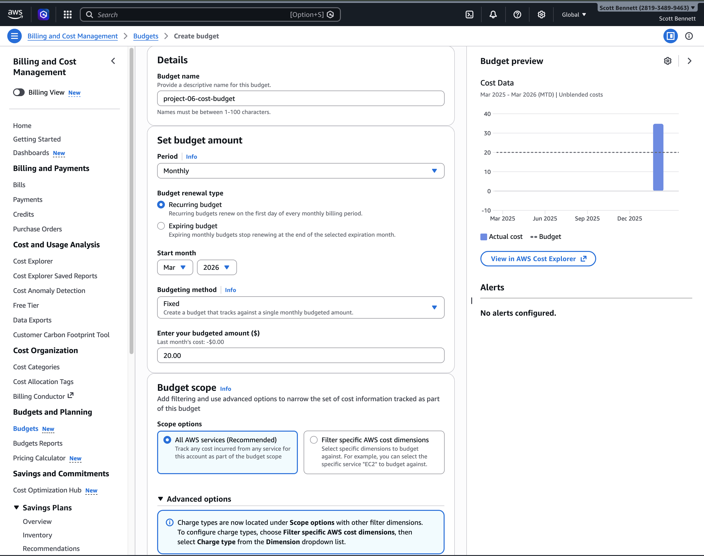
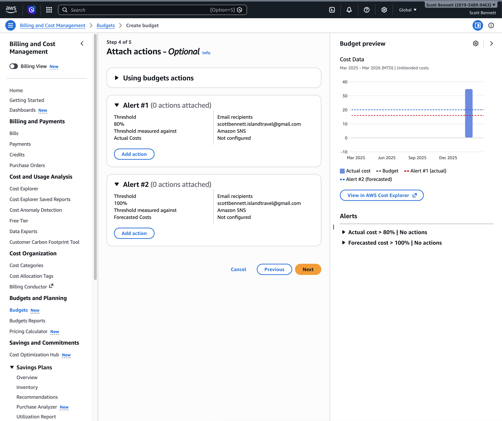
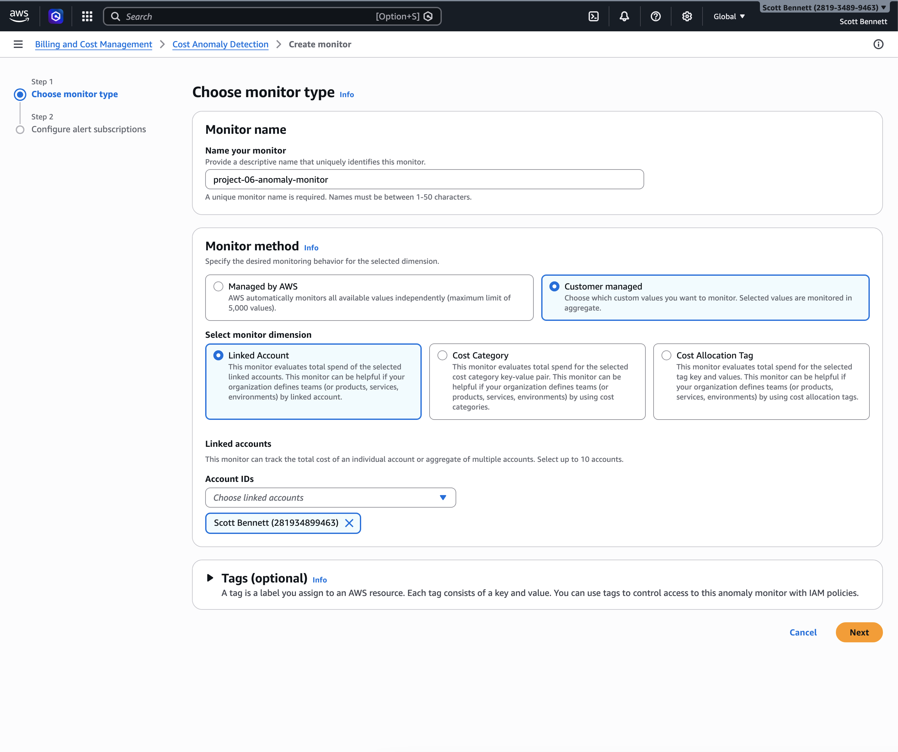
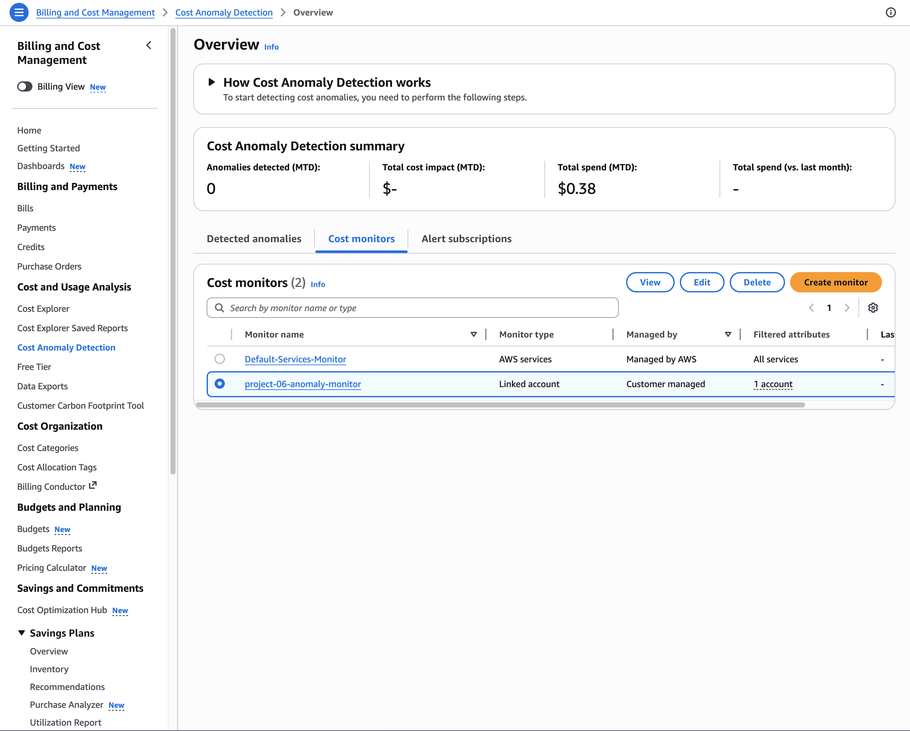

## AWS Pricing & Cost Optimisation Analysis

## Project Overview

This project demonstrates how AWS infrastructure costs can be analysed, monitored, and optimised using AWS pricing tools and cost management services.

The goal of this project is to compare different cloud architecture strategies and evaluate their financial impact using the **AWS Pricing Calculator**.

Three architecture models were analysed:

- Baseline architecture
- High availability architecture
- Cost optimised architecture

In addition to cost estimation, AWS cost governance tools were implemented including:

- Cost allocation tags
- AWS Budgets
- SNS alert notifications
- Cost Anomaly Detection

This project demonstrates the importance of **cost awareness when designing cloud infrastructure**.

---

## Services Used

- Amazon EC2
- Elastic Load Balancing (Application Load Balancer)
- Amazon RDS (PostgreSQL)
- Amazon S3
- AWS Pricing Calculator
- AWS Budgets
- Amazon SNS
- AWS Cost Anomaly Detection
- Cost Allocation Tags

---

## Architecture Overview

The architecture used in this project represents a small web application deployment.

User
↓
Application Load Balancer
↓
EC2 Web Server
↓
Amazon RDS PostgreSQL Database
↓
Amazon S3 Object Storage

---

## Cost Comparison

| Architecture | Monthly Cost |
|---|---|
Baseline Architecture | $88.95 |
High Availability Architecture | $136.61 |
Cost Optimised Architecture | $70.63 |

---

## Baseline Architecture

The baseline architecture models a typical small production deployment.

Components:

- 1 EC2 instance (t3.small)
- Application Load Balancer
- Amazon RDS PostgreSQL (Single-AZ)
- Amazon S3 storage

This architecture prioritises simplicity while maintaining standard web application infrastructure.

---

## High Availability Architecture

To improve reliability and remove single points of failure, the architecture was modified.

Changes implemented:

- EC2 instances increased from **1 → 2**
- Amazon RDS changed from **Single-AZ → Multi-AZ deployment**

Benefits:

- Improved fault tolerance
- Increased resilience against infrastructure failures
- Improved service availability

Trade-off:

- Higher infrastructure cost.

---

## Cost Optimised Architecture

The architecture was then optimised to reduce operational costs while maintaining functionality.

Optimisations implemented:

- EC2 instance resized from **t3.small → t3.micro**
- Storage usage optimised
- Infrastructure reviewed for unnecessary resource allocation

Result:

- Reduced monthly infrastructure cost while maintaining core application functionality.

---

## Cost Governance Implementation

In addition to cost estimation, AWS cost monitoring tools were implemented.

## Cost Allocation Tags

Cost allocation tags allow organisations to track and organise AWS spending by project, team, or environment.

Tags created:

| Key | Value |
|---|---|
Project | AWS-Portfolio |
Environment | Dev |
Owner | Scott |

These tags allow infrastructure costs to be categorised and analysed.

---

## AWS Budget Configuration

An AWS budget was created to monitor monthly cloud spending.

Configuration:

- Budget type: **Cost Budget**
- Monthly limit: **$100**
- Alert threshold: **80%**

This ensures cost visibility and early warning when spending approaches the defined limit.

---

## Budget Alert Notifications

Amazon SNS was configured to send notifications when budget thresholds are exceeded.

Configuration:

- SNS Topic created
- Email subscription configured
- Budget alerts linked to SNS topic

This enables real-time cost alerts.

---

## Cost Anomaly Detection

AWS Cost Anomaly Detection was configured to monitor unusual spending patterns.

Features:

- Automatically analyses historical spending patterns
- Detects unexpected cost spikes
- Sends alerts via SNS notifications

This helps identify potential issues such as:

- misconfigured resources
- unexpected usage spikes
- infrastructure errors

---

## Key Concepts Demonstrated

This project demonstrates several important cloud engineering concepts:

- AWS pricing estimation
- Cost comparison between architecture designs
- High availability cost trade-offs
- Infrastructure right-sizing
- Cloud cost governance
- Budget monitoring and alerting
- Anomaly detection for unexpected cost increases

---

## What I Learned

Through this project I learned:

- High availability architectures increase reliability but also increase operational cost.
- Right-sizing infrastructure is one of the most effective cost optimisation techniques.
- Cost monitoring tools are essential for maintaining financial control in cloud environments.
- AWS Pricing Calculator is a powerful tool for forecasting infrastructure costs before deployment.

---

## Evidence

## Baseline Architecture Cost Estimate

---

## High Availability Architecture Estimate

---

## Cost Optimised Architecture Estimate

---

## Cost Allocation Tags

---

## AWS Budget Configuration

---

## SNS Budget Alert Configuration

---

## Cost Anomaly Detection Monitor

---

## Cost Anomaly Detection Dashboard

---

# Conclusion

Cloud engineers must balance:

- reliability
- performance
- cost efficiency

This project demonstrates how architectural design decisions directly influence cloud infrastructure cost and highlights the importance of implementing cost monitoring and optimisation strategies when building cloud solutions.
